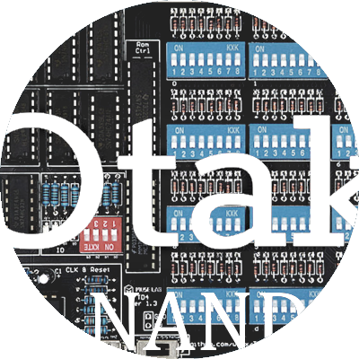

  <h1 align="center">otak-nand</h1>
  
An educational digital circuit puzzle game for VS Code - Build complex logic circuits starting from NAND gates.

---

## Usage

1. Open any workspace in VS Code
2. Access the NAND game interface from the editor
3. Start building circuits using NAND gates
4. Progress through increasingly complex challenges

## Features

otak-nand is an interactive VS Code extension that teaches digital circuit design through hands-on puzzle solving.

### Key Features

- **Progressive Learning Path**:
  - Start with basic NAND gates
  - Build increasingly complex circuits
  - Learn fundamental digital logic concepts
  - Work towards processor construction

- **Interactive Circuit Building**:
  - Drag and drop interface
  - Real-time circuit simulation
  - Visual signal flow
  - Immediate feedback

- **Structured Learning Stages**:

#### Stage 1: Logic Gates
- NAND gate fundamentals
- NOT gate implementation
- AND gate construction
- OR gate design
- XOR gate creation

#### Stage 2: Arithmetics
- Half Adder development
- Full Adder implementation
- Multi-bit Adder construction
- Increment circuit design
- Subtraction implementation
- Zero comparison
- Negative number detection

#### Stage 3: Switching
- Selector circuits
- Switch implementation
- Arithmetic Logic Unit (ALU)
- Logic Unit design
- Arithmetic Unit construction
- ALU optimization
- Condition handling

#### Stage 4: Memory
- SR Latch design
- D Latch implementation
- Data Flip-Flop creation
- Register construction
- Counter development
- RAM implementation

#### Stage 5: Processor
- Memory integration
- ALU instruction handling
- Control selection
- Control Unit design
- Computer architecture
- I/O handling

- **Game Mechanics**:
  - ⭐️ Star rating system based on:
    - Minimum gate count
    - Minimum step count
    - Circuit efficiency
  - Achievement tracking
  - Circuit validation
  - Progress monitoring

- **Visual Interface**:
  - WebView-based circuit editor
  - Intuitive drag & drop controls
  - Real-time signal visualization
  - Progress tracking sidebar
  - Comprehensive tutorial system

## Requirements

- Visual Studio Code ^1.90.0
- No additional dependencies required

## Installation

1. Install through VS Code Marketplace
2. Open VS Code
3. Start building circuits using NAND gates
4. Progress through the learning stages

## Implementation Details

- **Circuit Validation**:
  - Automated test pattern verification
  - Real-time simulation feedback
  - Efficiency metrics calculation
  - Progress tracking

- **Tutorial System**:
  - Interactive guidance
  - Step-by-step instructions
  - Visual demonstrations
  - Contextual help

- **Progress Tracking**:
  - Persistent save system
  - Achievement monitoring
  - Star ratings
  - Level progression

## Related Extensions

### [otak-monitor](https://marketplace.visualstudio.com/items?itemName=odangoo.otak-monitor)
Track system resources in VS Code with real-time monitoring of CPU, memory, and disk usage.

### [otak-proxy](https://marketplace.visualstudio.com/items?itemName=odangoo.otak-proxy)
Simplify proxy configuration in VS Code with one-click setup for different network environments.

### [otak-committer](https://marketplace.visualstudio.com/items?itemName=odangoo.otak-committer)
AI-powered commit message generation supporting 25 languages and smart SCM operations.

### [otak-restart](https://marketplace.visualstudio.com/items?itemName=odangoo.otak-restart)
Quick restart tools for VS Code Extension Host and window via status bar.

### [otak-clock](https://marketplace.visualstudio.com/items?itemName=odangoo.otak-clock)
Dual time zone clock display for international development teams.

### [otak-pomodoro](https://marketplace.visualstudio.com/items?itemName=odangoo.otak-pomodoro)
Productivity timer implementing the Pomodoro Technique for balanced work sessions.

### [otak-zen](https://marketplace.visualstudio.com/items?itemName=odangoo.otak-zen)
Distraction-free coding environment with customizable UI element visibility.

## License

This project is licensed under the MIT License - see the [LICENSE](LICENSE) file for details.

---

For more information, visit the [GitHub repository](https://github.com/tsuyoshi-otake/otak-nand).
